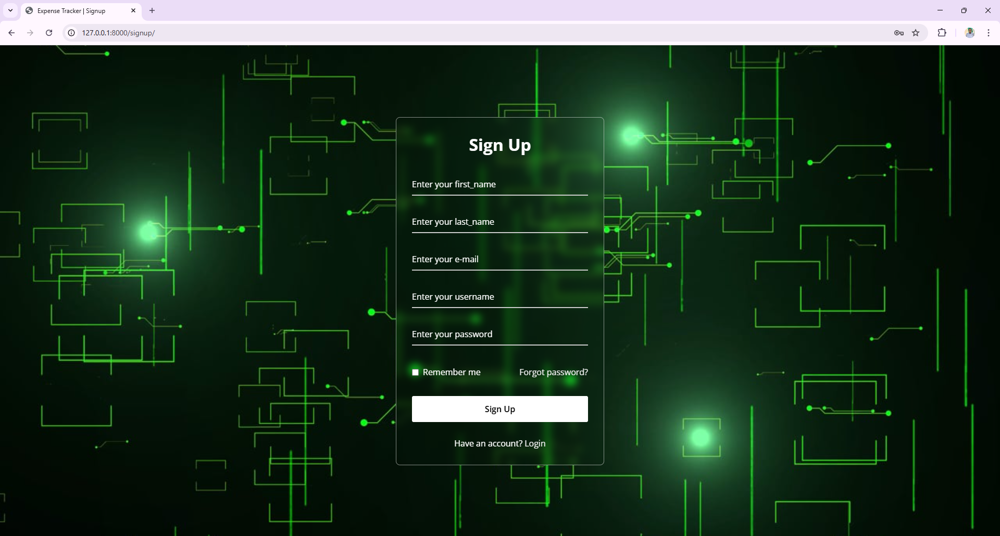
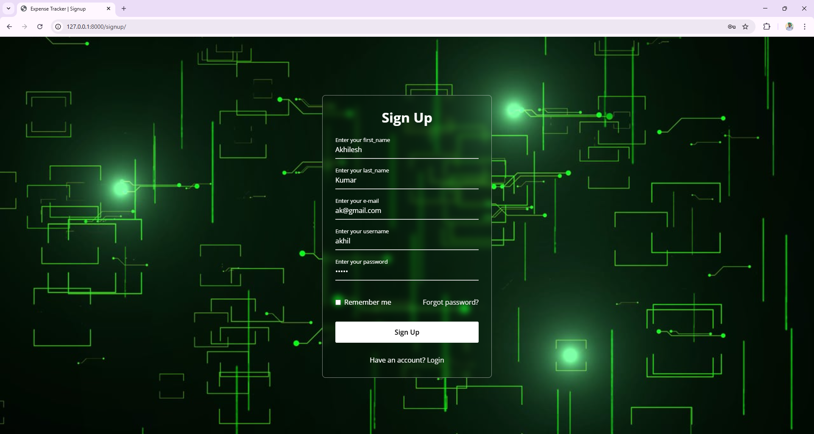
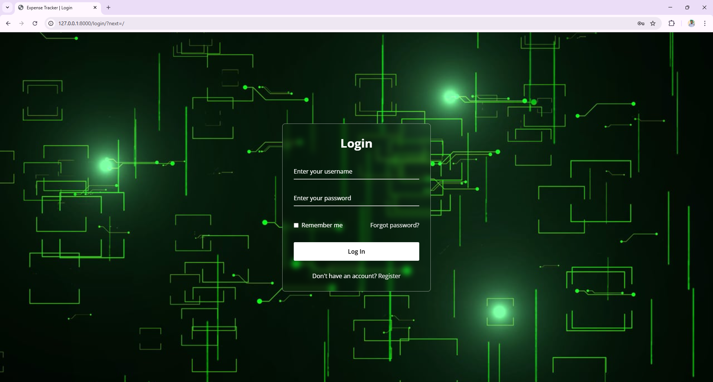
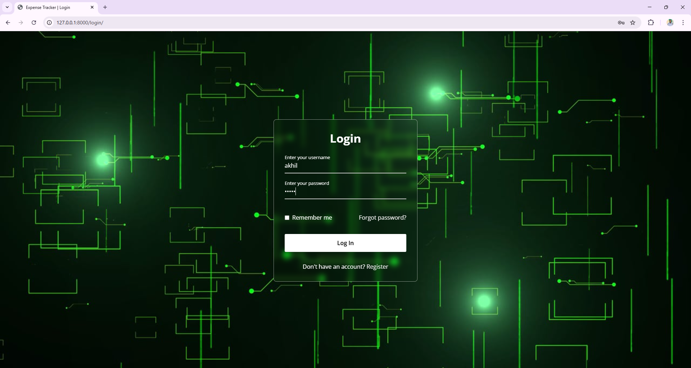
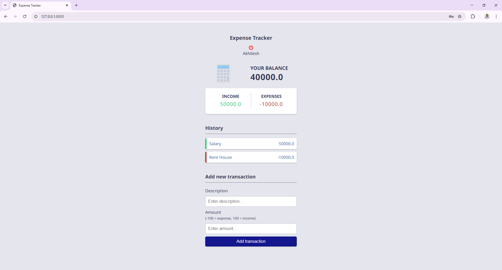
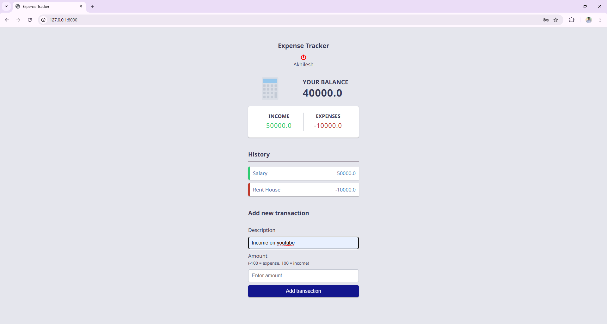
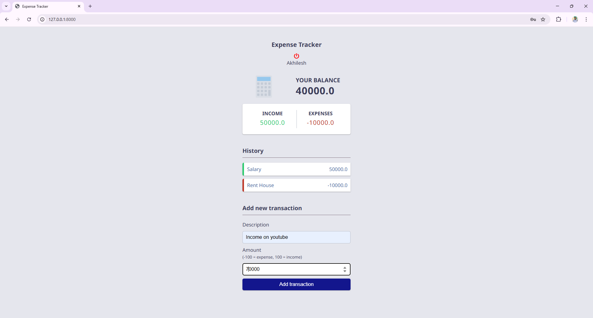
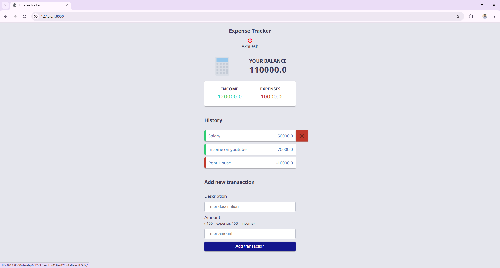
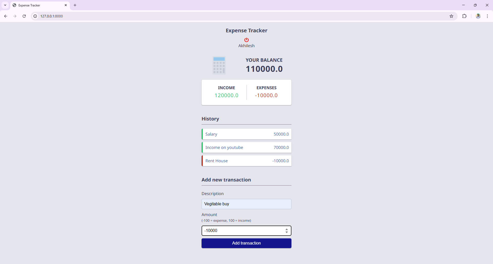

# Expense Tracker

Overall, Expense Tracker ek practical aur real-world project hai jo personal finance management ko simple, fast aur effective banata hai.

----

## Table of Contents
- [Overview](#overview)
- [Features](#features)
- [Tools and Technologies](#tools--technologies)
- [how to use](#how-to-use)
- [final](#final)
- [author](#author)

### Overview
Expense Tracker ek web application hai jo users ko expense ko track aur manage karne mein help karta hai.
Yeh project Django framework par based hai aur MySQL / PostgreSQL database ka use karta hai data securely store karne ke liye. Application fully responsive hai, isliye desktop aur mobile dono par smoothly work karta hai.

### Features
- User authentication (signup, login, logout)
- Add, edit, and delete expenses
- Categorize expenses (e.g., food, transport, entertainment)
- View expense history and statistics
- Set budgets and receive notifications when nearing limits

### Tools and Technologies
- Django (Python web framework)
- MySQL / PostgreSQL (database)
- HTML, CSS, JavaScript (frontend)
- Bootstrap (frontend framework)
- signup.html 
- signup process 
- login html 
- login process 
- index.html 
- add description 
- add income 
- expense delete 
- add expense 
- final view 

### how to use
- Clone the repository: `git clone https://github.com/your-username/expense-tracker.git`
- Navigate to the project directory: `cd expense-tracker`
- Install dependencies: `pip install -r requirements.txt`
- Set up the database: `python manage.py migrate`
- Create a superuser: `python manage.py createsuperuser`
- Run the development server: `python manage.py runserver`
- Access the application in your browser: `http://localhost:8000`

### final

### author
Akhilesh Kumar
<a href="mailto:akhilwebcode@gmail.com">email</a>
<a href="https://www.linkedin.com/in/stylewebcode/">linkedin</a>
<a href="https://github.com/stylewebcode">github swc</a>
<a href="https://github.com/akhilwebcode">github awc</a>
<a href="https://www.youtube.com/@akhilwebcode">youtube awc</a>
<a href="https://www.youtube.com/@stylewebcode">youtube awc</a>
